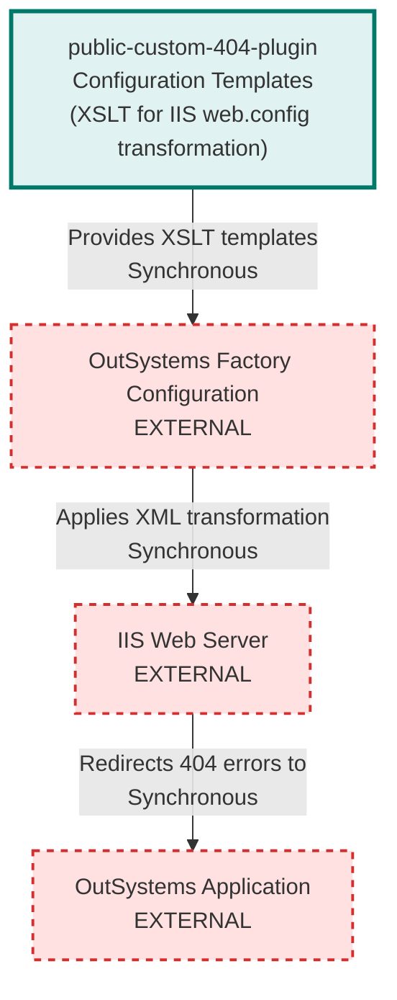

# Custom 404 Plugin Architecture

> **Repository:** public-custom-404-plugin
> **Type:** Configuration Templates (XSLT)
> **Runtime Environment:** N/A (Configuration files applied to IIS via OutSystems Factory Configuration)
> **Last Updated:** 2026-03-20

## Overview

This repository contains XSLT configuration templates for customizing HTTP 404 error handling in OutSystems applications running on IIS. The XSL files are not executable code - they are transformation templates applied to IIS web.config files through the OutSystems Factory Configuration tool to redirect 404 errors to custom application pages.

## Architecture Diagram

## External Integrations

| External System | Communication Type | Purpose |
|-----------------|-------------------|---------|
| OutSystems Factory Configuration | Sync (Configuration Import) | Administrators import these XSLT templates to create shared configurations |
| IIS Web Server | Sync (XML Transformation) | XSLT templates transform web.config files to add custom error handlers |
| OutSystems Application | Sync (HTTP Redirect) | IIS redirects 404 errors to custom error pages within OutSystems apps |

## Architectural Tenets

### T1. Identity Transformation with Selective Override

All XSLT templates follow the identity transformation pattern - they copy the entire XML tree unchanged except for specific nodes that need modification. This ensures that existing IIS configurations are preserved while only adding or modifying 404 error handling directives.

**Evidence:**
- `CustomErrorHandler.xsl` (template at line 9-13) - implements identity transformation copying all nodes and attributes by default
- `CustomErrorHandler.xsl` (template at line 15-23) - selectively overrides `/configuration/system.webServer` to inject httpErrors element
- `third_snippet.xsl` (template at line 2-6) - demonstrates selective attribute override for redirect URLs

### T2. Configuration Must Be Parameterized

Error page redirect URLs must be defined as XSL parameters at the top of the stylesheet, not hardcoded within templates. This allows administrators to change the target application and page names in a single location, improving maintainability and reducing errors.

**Evidence:**
- `CustomErrorHandler.xsl` (line 7) - defines `new404` parameter at stylesheet level containing the redirect URL
- `first_snippet.xsl` (line 2) - snippet shows parameterization pattern for documentation
- `third_snippet.xsl` (line 4) - template references parameter variable `$new404` rather than literal URL

### T3. Dual Error Handler Registration Required

Custom 404 error pages must be registered in both IIS 7+ (`system.webServer/httpErrors`) and legacy IIS 6 (`system.web/customErrors`) configuration sections to ensure compatibility across different IIS versions and hosting modes.

**Evidence:**
- `CustomErrorHandler.xsl` (line 18-22) - adds httpErrors element to system.webServer for IIS 7+ integrated pipeline
- `CustomErrorHandler.xsl` (line 26-30) - modifies redirect attribute in system.web/customErrors for IIS 6 compatibility
- `second_snippet.xsl` (line 1) - demonstrates IIS 7+ error element structure with ExecuteURL responseMode

### T4. URL Encoding Must Follow XSLT Rules

All URL query parameters in XSLT must use proper XML entity encoding (`&amp;` for ampersands) and be enclosed in single quotes within the select attribute. This prevents XML parsing errors and ensures URLs are correctly passed through the transformation.

**Evidence:**
- `CustomErrorHandler.xsl` (line 7) - uses `&amp;` entity encoding for URL query parameter separator
- `first_snippet.xsl` (line 2) - demonstrates single-quote wrapping for URL strings in select attributes
- `second_snippet.xsl` (line 1) - shows both entity encoding (`&amp;`) and attribute value quoting in path attribute

### T5. Templates Must Be Stateless and Reusable

XSLT templates are designed to be applied to any OutSystems application's web.config by simply changing the parameter values. They contain no environment-specific hardcoding beyond the parameterized application name and page name.

**Evidence:**
- `CustomErrorHandler.xsl` (line 7) - only parameter requiring customization is the redirect URL with app and page names
- All XSL files - contain no references to specific server names, domains, or environment-specific paths
- `CustomErrorHandler.xsl` - template structure is generic and can be applied to any IIS web.config file structure
